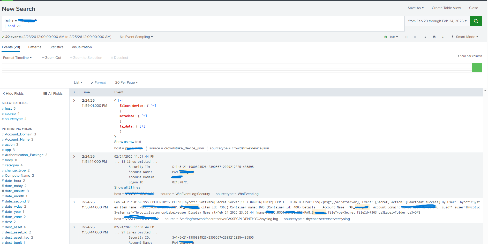

# T1003 Investigations – Visuals

## Overview

This repository contains **sanitized visual case studies** demonstrating real-world **Security Operations investigations** mapped to **MITRE ATT&CK Technique T1003 – Credential Dumping**.

The goal of this project is to showcase how high-severity endpoint detections are investigated using structured SOC methodology, focusing on:

- Process tree analysis
- Detection validation
- Incident response decision-making
- Alert fidelity improvement
- Behavioral vs malicious activity assessment

All screenshots and artifacts have been anonymized to remove organizational identifiers while preserving investigation workflow and technical accuracy.

---

## 🎯 Purpose

Modern security operations require analysts to do more than respond to alerts — they must **validate detections, reduce false positives, and improve response workflows**.

This repository demonstrates how investigations are performed to:

- Validate credential dumping detections
- Improve detection confidence
- Support incident response decisions
- Strengthen security operations workflows

---

## 🔍 Case Study: MITRE ATT&CK T1003 – Credential Dumping

### Detection Summary
- **Platform:** CrowdStrike Falcon
- **Technique:** T1003 – Credential Dumping
- **Detection:** Registry hive credential access
- **Severity:** Critical


Credential dumping techniques target authentication secrets stored within operating systems to enable privilege escalation and lateral movement.

---

## 🧬 Investigation Methodology

### 1️⃣ Process Tree Analysis
Validated execution lineage by reviewing parent-child relationships:


**Key Validation Goals:**
- Identify suspicious parent processes
- Detect abnormal execution chains
- Confirm interactive user context

---

### 2️⃣ Behavioral Validation
Since EDR detections are behavior-based, investigation focused on intent validation through process execution telemetry:


- Binary path verification
- Command-line analysis
- User session context
- Follow-on activity review
- Lateral movement indicators

---

### 3️⃣ SIEM & Artifact Discovery
To correlate endpoint behavior with broader network activity, SIEM field discovery and specific artifact validation queries were utilized to ensure full visibility:



**Query Validation:**
Below are the logic steps used to filter and validate the artifacts discovered during the investigation.


---

### 4️⃣ Analyst Decision
- **No** malicious parent process
- Legitimate execution context identified
- **No** follow-on indicators of compromise

**Classification:** Authorized Administrative Activity  
**Outcome:** Documented and closed with validation evidence.

---

## 🎤 Interview Preparation (Based on My Experience)

This repository also serves as a structured reference for explaining investigation techniques during security engineering interviews.

### ❓ Walk me through a recent security investigation.
1. Analyze alert context and MITRE mapping
2. Validate process lineage
3. Review execution behavior
4. Confirm user and system context
5. Assess risk and determine response action

### ❓ How do you reduce false positives?
- Correlate EDR telemetry with authentication logs
- Validate execution lineage
- Improve detection logic through query refinement
- Use contextual risk signals (asset criticality, exposure, identity activity)
*(Aligned with experience improving alert accuracy by 30–40%)*

---

## 🛠 Skills Demonstrated

- **Security Operations Engineering**
- **Incident Response & Investigation**
- **CrowdStrike Falcon Analysis**
- **SIEM Correlation (Splunk / Sentinel)**
- **Detection Engineering**
- **Alert Fidelity Optimization**
- **Threat Validation & Risk Analysis**

```

---

### A small tip for your repo:

I noticed one of your filenames has a trailing space: `Process Tree .png`. GitHub can sometimes be finicky with spaces in URLs. If the image doesn't render, I recommend renaming that file to `Process_Tree.png` (no space) and updating the link in the README.

**Would you like me to help you write a summary "Blurb" for your GitHub profile or LinkedIn that highlights this specific project?**
